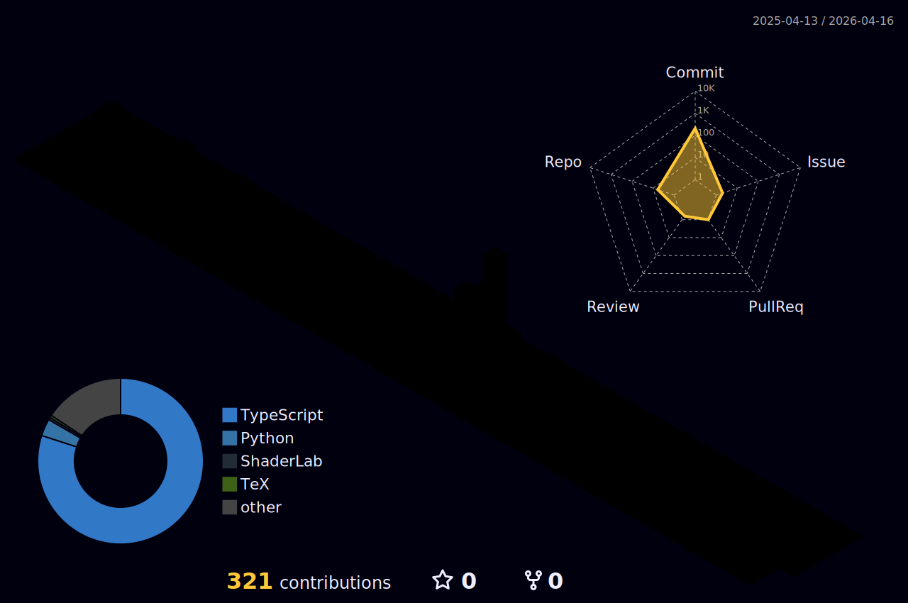

### 👋 Olá, eu sou o Isllan!

💻 Sou um desenvolvedor Full Stack em formação, apaixonado por tecnologia e soluções criativas.  
🎓 Cursando **Ciência da Computação** | 🔰 **Oficial do Exército Brasileiro**  
📍 Residente em **Vila Velha - ES**

---

### 🛠️ Tecnologias e Ferramentas

Atualmente trabalho com as seguintes linguagens e ferramentas:

 
  
  
  
  
  
  
  

---

### 🏆 GitHub Trophies

---

### 📊 Estatísticas do GitHub

  

---

### 🚀 Projetos em Destaque

🔧 Conversor de imagens para formato WebP:  

🧮 Calculadora moderna e responsiva:  

---

### 🌐 Conecte-se comigo

---

### 🎮 Hobbies e Curiosidades

- 💻 Entusiasta em desenvolvimento de software e automação.
- 🎵 Amante de música, guitarra e jogos retrô.
- 🎯 Sempre em busca de evolução pessoal, técnica e novos desafios.

---

📫 Fique à vontade para explorar meus repositórios ou entrar em contato!
